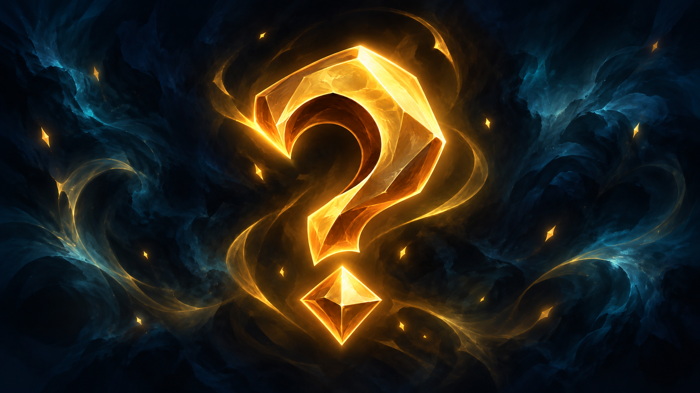

Humans are artisans of hope and action, a people of boundless creativity and an unquenchable thirst for adventure. They raise cities of stone and metal, work steel and tame a nascent magic. Forever on the move, they cross plains, forests and mountains, guided by curiosity and the wish to understand. Humans cherish art and music, celebrate poetry as much as ingenuity, and know how to savour simple pleasures as well as great conquests. Their heart swings endlessly between a passion for renewal and respect for tradition.

> "Arthur, look at these steles: so many men and elves have shed their blood here. How many more lives must be sacrificed before we understand that victory by the sword does not forge peace? If humanity wants to endure in these lands, it must raise the word before arms, use its ingenuity to build bridges rather than ramparts, and set diplomacy at the heart of its designs. The Bastion must embody that design: a home of reconciliation where this senseless slaughter finally ends."
>
> :source[Jacques "Le Scéllaire" Arsenault, addressing Arthur Gwynnor at the dawn of the great battle of Brécelann.]

## Diplomats from another world

Having come ashore from the lost continent of Pandore, the humans of Eden had to seek their salvation in the eloquence of pacts rather than in the clash of arms. The humans of Eden excel in the art of negotiation and alliance. Whether they present themselves as knights of Nouvelle-Aubaine, engineers of Landenheit or scholars of Victoria, they know how to weave networks of trust with the other peoples.

Trade becomes a universal language: cargoes of silks, spices or steam-driven mechanisms travel under the auspices of skilled emissaries, always ready to strike a mutually beneficial deal. This pragmatic diplomacy makes humans the natural mediators of Eden.

## Alliances and armies

The **Weitzguard** is the military and economic alliance forged by Nouvelle-Aubaine, Landenheit and Victoria to guarantee human security and prosperity on Eden. At the heart of this union stand the **Parangons**, an elite corps that combines the duties of a city militia, the rigour of a special police force and the courage of hunters of supernatural creatures. They roam wild lands and fortified cities to come to the aid of the people, tracking monsters and conspiracies with steel and magical art.

Every great city keeps its garrison of Parangons, while the most seasoned wander from one kingdom to the next, seconded by the **Drystvyr**: a foreign corps open to every non-human volunteer eager to defend the inhabitants of Eden. Together, Parangons and Drystvyr are the armed hand of the Weitzguard, seeing to it that peace and trade flourish where once only swords and fear held sway.

## A need to belong

In human cities, the authorities set up the guild model to give every field its structure: trade, craftsmanship, knowledge or magic. So the guild of the **Sagemeisters**, although founded by humans, brings together mostly non-human scholars, and coordinates the scientific expeditions and the recording of Eden's customs. Likewise the **Assemblée des Oracles**, the supreme body of the esoteric arts, gathers six **Oracles** elected for their unequalled mastery of their art, to regulate the teaching and use of magic in every academy.

Other brotherhoods have come into being: guilds of smiths and engineers, circles of healers exploring remedies and herbalism, companies of diplomats and leagues of cartographers charting roads and communication networks. Each guild, springing from the human cities, acts as a node of expertise and solidarity, strengthening cooperation, the passing on of knowledge, and resilience in the face of Eden's endless trials.

## Nomad scholars

Humans carry within them the drive of discovery and a morality shaped by uprooting: they see every native people as the keeper of precious knowledge, and seek above all to understand rather than to dominate. Although frictions arise (notably with the elves), most humans show sincere goodwill, respecting local customs and taking care not to erode established balances.

Their ingenuity unfolds as much in the exploration of magical arcana as in the study of galdùrian traditions and draconic rites, and they ground their actions in a moral code that values exchange, hospitality and shared progress. Firmly believing that every encounter is a chance for mutual enrichment, they build cultural bridges.

## Human names

Humans receive their first name at birth, chosen by their parents in tribute to a valiant ancestor, a legendary hero or a virtue they hope to see flourish. That name stays the same for life. First names are clearly gendered and vary with tradition. Each first name follows a general trend particular to its region of origin.

All of them also bear an inherited family name, handed down from generation to generation, which recalls the history of the house: a trade, a place name or a social standing. Some adjust the pronunciation or spelling of their surname to settle into a new community, while others jealously preserve its original form, ensuring the continuity of their line.
